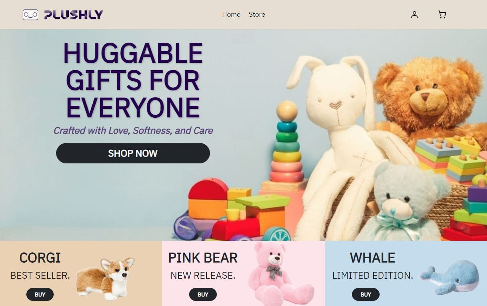
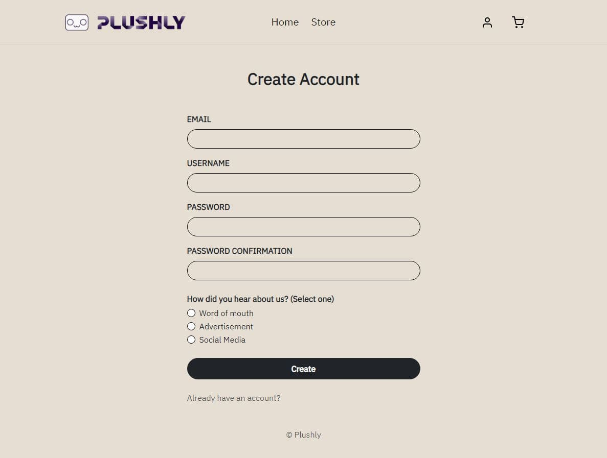
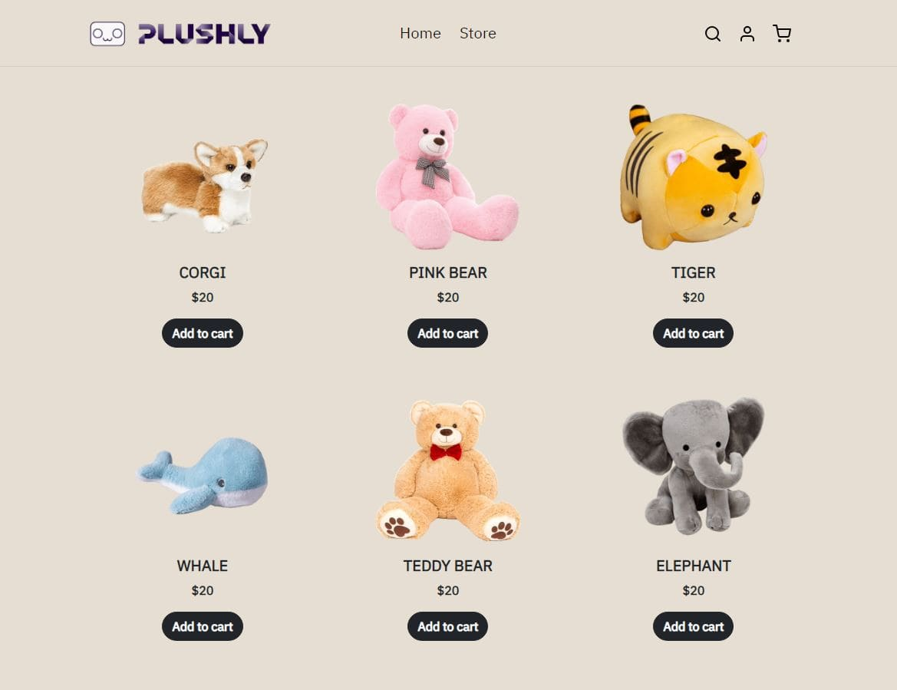

# Plushly

Plushly is an e-commerce website that sells plushies. This is a project, not an actual business.

# Features

- **Five pages**: Landing, login, signup, products, and checkout pages
- **Responsive Design**: Accessible on all devices, ensuring a smooth experience whether you're on a desktop, tablet, or mobile phone.
- **Form validation**: Inputs must meet the specified requirements; input fields are color coded as green or red for valid/invalid inputs

# Technologies

- HTML
- CSS
- JavaScript
- Bootstrap 5

# Preview

## Landing page



## Login page


## Signup page



## Products page



## Checkout page


# Code Snippet

Below is a code snippet for the Order Summary dropdown. When the screen is smaller than large (<992px), the Order Summary will convert from a table to a dropdown, which can be minimized or expanded.


```html
<div class="btn-group d-flex flex-column d-lg-none my-2">
  <button
    class="btn btn-secondary dropdown-toggle"
    type="button"
    data-bs-toggle="dropdown"
    data-bs-auto-close="false"
    aria-expanded="false"
  >
    Order Summary
  </button>
  <ul class="dropdown-menu w-100 position-relative bg-darker-cream">
    <li class="d-flex justify-content-between mx-4">
      <div class="d-flex align-items-center">
        
        <div>
          <h6 class="my-0 fw-bold">CORGI</h6>
          <small class="text-muted">Quantity: 1</small>
        </div>
      </div>
      <span class="text-muted">$20</span>
    </li>
    ...
  </ul>
</div>
```


# Future features

- A cart system where users can add products to a cart
- More robust form validations
- Backend system where users can create an account